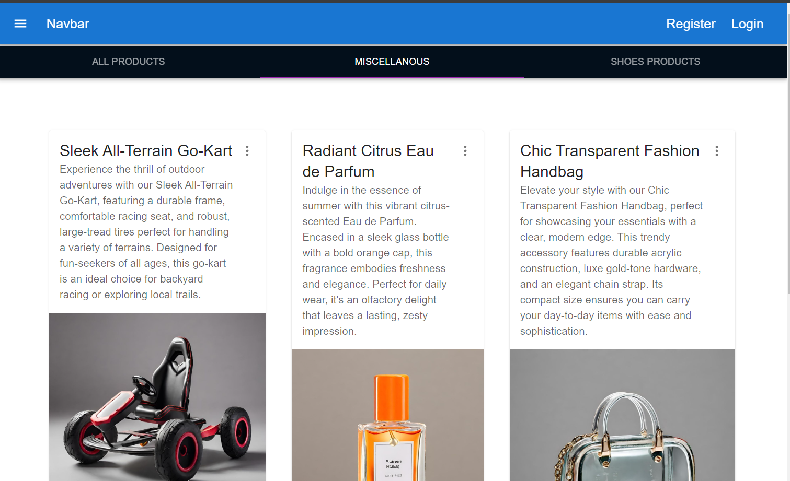
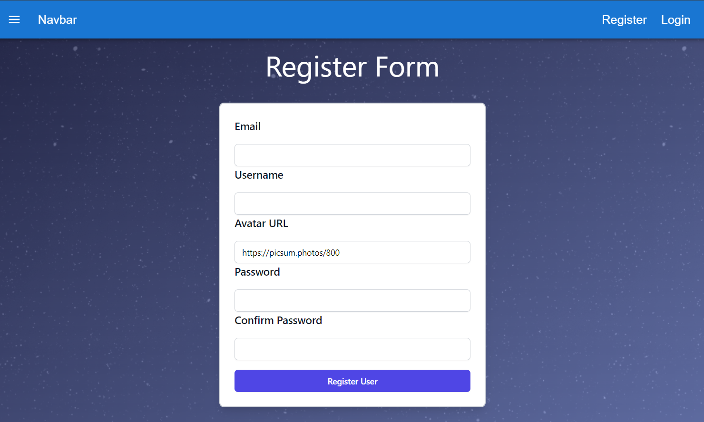
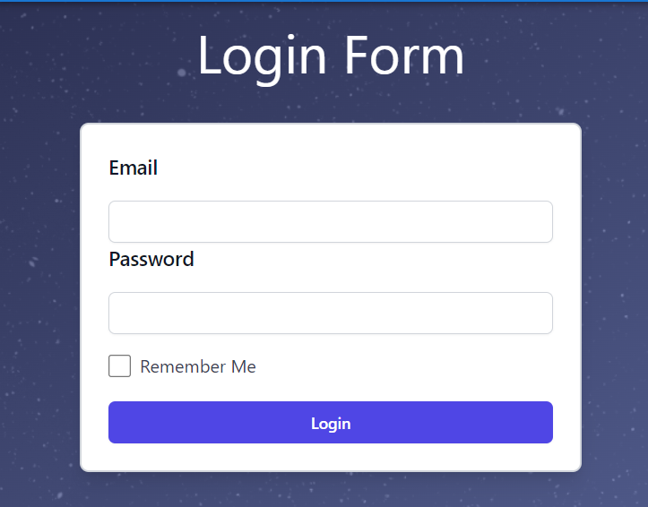
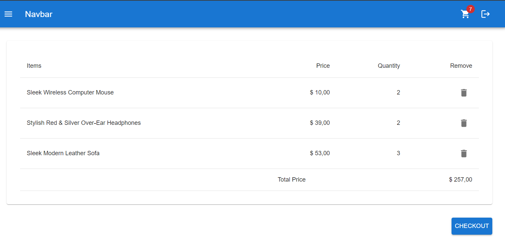
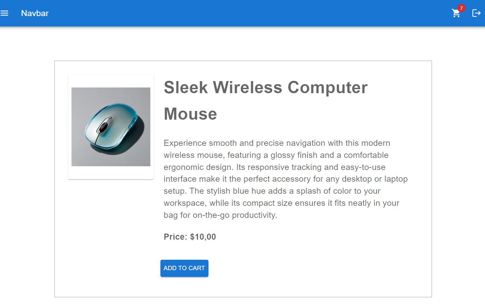
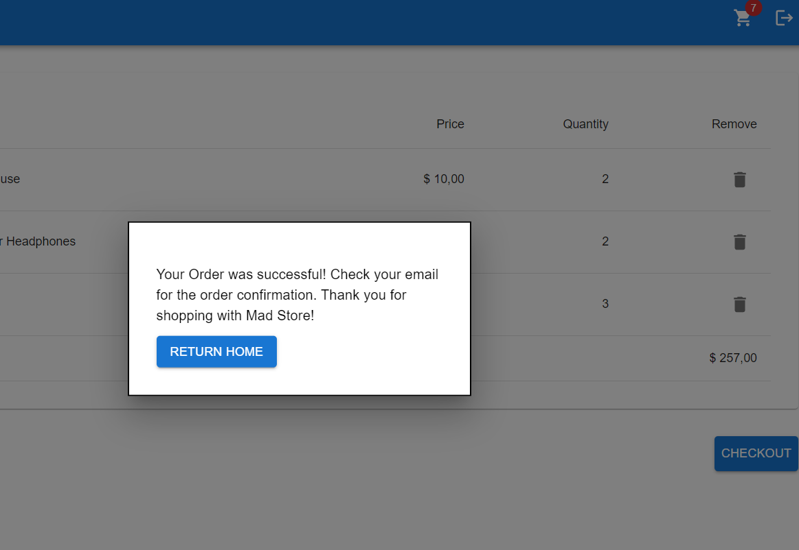

# Mamad Mini Store Project Milestone 2

### Overview

This project is a simple store application that interacts with a backend API provided by [Platzi's Fake API](https://fakeapi.platzi.com/). The application fetches products from all categories, with a particular focus on the "Miscellaneous" and "Shoes" categories. Users can browse through these products, view detailed information, add items to their cart, and proceed to checkout. The app also includes essential features such as user authentication (login, register, logout), and displays the total price of the items in the cart.

### Features

- Vite: A fast development build tool that enhances the development experience with instant server start and fast Hot Module Replacement (HMR).
- User Authentication: Users can create an account, log in, and log out securely.
- Product Listing: View all products across different categories, with special categories for "Miscellaneous" and "Shoes".
- Product Details: Click on a product to view detailed information, including price and description.
- Add to Cart: Add products to the shopping cart for purchase.
- Checkout: Proceed to checkout with the items in the cart, and view the total price of the selected products.

### Tech Stack

The application is built using the following technologies:

- Vite: A development tool that provides fast, modern build processes.
- Tailwind CSS: For styling the components and ensuring a responsive design.
- React: A JavaScript library for building user interfaces, used to create dynamic and interactive components.
- MUI Material: A library of React UI components that implements Google's Material Design.
- TypeScript: A statically typed language that builds on JavaScript, providing better tooling and more robust code.

### Installation

To set up the project locally, follow these steps:

1. Clone the repository:

```
git clone
```

2. Install dependencies

```
npm install
```

3. Run the application:

```
npm run dev
```

4. Open your browser and navigate to:

```
http://localhost:5173/
```

### Usage

- Register or Log In to start using the app.
- Browse products by category to find specific items.
- Add items to your cart and view the cart to see all added products.
- The checkout process will show you a pop up and clear the products in cart then navigate the user to the Home page.

### Showcases

All Products and Categories


Register and Login Form




Cart Page


Product Detail Page


Checkout Modal


## Deployment Link

[https://milestone-2-kingahmadr.vercel.app/](https://milestone-2-kingahmadr.vercel.app/)

### Contributing and Development

Clone the repository and checkout with a new branch for development or fork the project to your repository

### Enjoy shopping with the Mad Store App!

```

```
